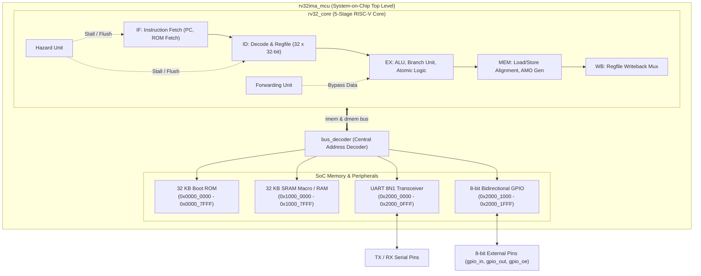
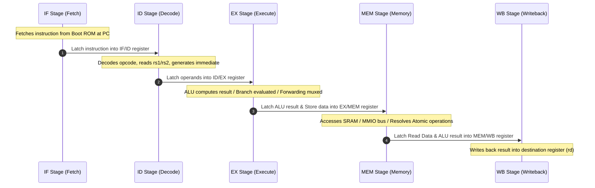

# Minimal RV32IMA Microcontroller

<div align="center">

[-blue.svg?style=for-the-badge&logo=microchip)](rtl/)
[](docs/isa.md)
[](syn/)
[](docs/saed_integration.md)
[-brightgreen.svg?style=for-the-badge)](docs/verification.md)
[-red.svg?style=for-the-badge)](syn/constraints.sdc)

**A high-performance, synthesizable 32-bit RISC-V Microcontroller implemented in IEEE 1800-2017 SystemVerilog.**  
Targeting **Synopsys Design Compiler** and **IC Compiler II** with the **Synopsys SAED PDK** standard cell and SRAM macro library.

[Architecture](docs/architecture.md) • [ISA Reference](docs/isa.md) • [Memory Map](docs/memory_map.md) • [Verification](docs/verification.md) • [SAED Integration](docs/saed_integration.md) • [Web Visualizer](visualizer/)

</div>

---

## Table of Contents

- [Overview](#overview)
- [Key Features](#key-features)
- [System Architecture](#system-architecture)
- [Microarchitecture & Pipeline](#microarchitecture--pipeline)
- [Memory Map](#memory-map)
- [Repository Layout](#repository-layout)
- [Getting Started](#getting-started)
  - [Prerequisites](#prerequisites)
  - [1. Compile Firmware](#1-compile-firmware)
  - [2. Run Regression Test Suite](#2-run-regression-test-suite)
  - [3. Interactive Web Visualizer](#3-interactive-web-visualizer)
  - [4. Waveform Inspection with GTKWave](#4-waveform-inspection-with-gtkwave)
  - [5. ASIC Synthesis with Synopsys DC](#5-asic-synthesis-with-synopsys-dc)
- [ASIC Implementation Metrics](#asic-implementation-metrics)
- [Verification Matrix](#verification-matrix)
- [Documentation Index](#documentation-index)
- [License](#license)

---

## Overview

The **Minimal RV32IMA Microcontroller** (`rv32ima_mcu`) is a fully synthesizable System-on-Chip (SoC) designed for embedded control applications. It couples a classic 5-stage in-order RISC-V core with complete support for base integer instructions (**RV32I**), hardware integer multiplication and division (**RV32M**), and atomic memory operations (**RV32A** with LR/SC and AMOs).

The SoC integrates on-chip memories (32 KB Boot ROM, 32 KB SRAM with SAED SRAM macro abstraction), a centralized memory-mapped bus decoder, an 8N1 UART serial transceiver, and an 8-bit bidirectional GPIO peripheral with per-pin direction control.

```
       +-----------------------------------------------------------------------+
       |                           rv32ima_mcu                                 |
       |                                                                       |
       |   +---------------+            +----------------------------------+   |
       |   |   rv32_core   | <========> |            bus_decoder           |   |
       |   | (5-Stage Pipe)|  Mem Bus   +--+------------+-------------+----+   |
       |   +---------------+               |            |             |        |
       |                                   v            v             v        |
       |                          +--------------+ +----------+ +----------+   |
       |                          |memory_wrapper| |   uart   | |   gpio   |   |
       |                          |  ROM + SRAM  | |   8N1    | | 8-bit IO |   |
       |                          +--------------+ +----------+ +----------+   |
       +-----------------------------------------------------------------------+
```

---

## Key Features

### Processor Core (`rv32_core.sv`)
- **RV32I Base Integer**: Full user-level 32-bit integer ISA (Arithmetic, Shifts, Logical, Jumps, Branches, Loads, Stores).
- **RV32M Multiplier / Divider**: Hardware integer math execution.
- **RV32A Atomic Memory Operations**: Full atomic suite including reservation-based `LR.W`/`SC.W` and Read-Modify-Write atomics (`AMOADD`, `AMOSWAP`, `AMOXOR`, `AMOAND`, `AMOOR`, `AMOMIN`, `AMOMAX`, `AMOMINU`, `AMOMAXU`).
- **5-Stage In-Order Pipeline**: Fetch (IF) &rarr; Decode (ID) &rarr; Execute (EX) &rarr; Memory (MEM) &rarr; Writeback (WB).
- **Bypass & Forwarding Unit**: Resolves Read-After-Write (RAW) data hazards with EX/MEM &rarr; EX and MEM/WB &rarr; EX forwarding paths with zero stall penalties.
- **Hardware Hazard Unit**: Resolves load-use stalls via automatic 1-cycle bubble injection and handles branch/jump flushes (2-cycle penalty).
- **Branch Resolution in EX**: Fast condition evaluation and target address calculation in execution stage.
- **Privilege & System Control**: Machine-mode CSRs (`mstatus`, `mie`, `mtvec`, `mepc`, `mcause`), `ECALL`, `EBREAK`, `MRET`, and `WFI`.

### SoC Peripherals & Subsystems
- **Centralized Bus Interconnect**: Zero-wait memory bus with 32-bit address and data routing, byte strobe byte-enables (`wstrb[3:0]`), and ready handshaking.
- **Memory Subsystem (`memory_wrapper.sv`)**: Dual-mode memory supporting behavioral synthesizable RAM for simulation and vendor-isolated `saed_sram_wrapper.sv` macro instantiation for SAED PDK ASIC tapeout.
- **8N1 Serial UART (`uart.sv`)**: Configurable baud rate generator (115200 baud default @ 50 MHz), internal RX double-flop synchronizer, and status registers with auto-clearing flags.
- **Bidirectional GPIO (`gpio.sv`)**: 8-bit parallel I/O with individual tri-state output-enable direction masks (`gpio_oe`), input synchronizers, and active state latching.

---

## System Architecture



---

## Microarchitecture & Pipeline



For a comprehensive deep-dive into each pipeline stage, hazard resolution, atomic logic, and forwarding truth tables, see [`docs/architecture.md`](docs/architecture.md).

---

## Memory Map

The microcontroller features a 32-bit unified physical memory map:

| Base Address | End Address | Region | Size | Access Type | Description |
| :--- | :--- | :--- | :--- | :--- | :--- |
| `0x0000_0000` | `0x0000_7FFF` | **Boot ROM** | 32 KB | R / X | Preloaded firmware reset vector, interrupt routines, constants |
| `0x1000_0000` | `0x1000_7FFF` | **SRAM** | 32 KB | R / W / X | Main system memory for stack, heap, and runtime variables |
| `0x2000_0000` | `0x2000_0FFF` | **UART** | 4 KB | R / W | Serial port `TXDATA`, `RXDATA`, `STATUS`, `BAUD` registers |
| `0x2000_1000` | `0x2000_1FFF` | **GPIO** | 4 KB | R / W | General-purpose I/O `DATA` and `DIR` registers |
| `0x2000_2000` | `0x2000_2FFF` | **Timer** | 4 KB | — | *Reserved for system timer extension* |

> [!TIP]
> Complete bitfield mappings, register offsets, and C-driver headers are available in [`docs/memory_map.md`](docs/memory_map.md).

---

## Repository Layout

```
minimal_mcu/
├── rtl/                         # Synthesizable IEEE 1800-2017 SystemVerilog RTL
│   ├── core/                    # Processor core microarchitecture
│   │   ├── rv32_pkg.sv          # Central definitions, opcodes, ALU ops, trap enums
│   │   ├── alu.sv               # 32-bit Arithmetic Logic Unit
│   │   ├── regfile.sv           # 32 x 32-bit register file (dual read, single write)
│   │   ├── decoder.sv           # Main control decoder & instruction classifier
│   │   ├── immediate_gen.sv     # Immediate generator (I, S, B, U, J, CSR types)
│   │   ├── pc_reg.sv            # Program counter register with stall/flush logic
│   │   ├── branch_unit.sv       # Branch condition evaluator & jump target adder
│   │   ├── forwarding_unit.sv   # EX/MEM and MEM/WB operand bypass unit
│   │   ├── hazard_unit.sv       # Load-use hazard detection and pipeline flusher
│   │   ├── atomic_unit.sv       # RV32A atomic controller (LR/SC reservation + AMOs)
│   │   └── rv32_core.sv         # 5-stage core top-level pipeline
│   ├── pipeline/                # Synchronous pipeline stage registers
│   │   ├── if_id.sv             # Fetch / Decode pipeline register
│   │   ├── id_ex.sv             # Decode / Execute pipeline register
│   │   ├── ex_mem.sv            # Execute / Memory pipeline register
│   │   └── mem_wb.sv            # Memory / Writeback pipeline register
│   ├── bus/                     # Bus interconnect
│   │   └── bus_decoder.sv       # Address decoder & peripheral memory multiplexer
│   ├── memory/                  # Memory subsystem
│   │   ├── rom.sv               # Boot ROM model with $readmemh support
│   │   ├── ram.sv               # Synthesizable behavioral single-port SRAM
│   │   ├── saed_sram_wrapper.sv # SAED 32nm SRAM hard-macro instantiation wrapper
│   │   └── memory_wrapper.sv   # Generic vs PDK macro compile-time multiplexer
│   ├── peripherals/             # Integrated memory-mapped I/O peripherals
│   │   ├── uart.sv              # 8N1 UART controller with baud rate generator
│   │   └── gpio.sv              # 8-bit bidirectional GPIO controller
│   └── rv32ima_mcu.sv           # SoC top-level wrapper
│
├── tb/                          # Self-checking SystemVerilog testbenches
│   ├── tb_alu.sv                # ALU operations unit test
│   ├── tb_regfile.sv            # Register file zero-enforcement & sweeps
│   ├── tb_immediate_gen.sv      # Immediate extraction & sign-extension test
│   ├── tb_decoder.sv            # Instruction decoder & control signal matrix test
│   ├── tb_pipeline_regs.sv      # Pipeline register stall, flush, hold validation
│   ├── tb_branch_unit.sv        # Branch conditions and jump calculation test
│   ├── tb_forwarding_unit.sv    # RAW hazard forwarding priority test
│   ├── tb_hazard_unit.sv        # Load-use bubble injection and flush precedence
│   ├── tb_core.sv               # Core pipeline integration verification
│   ├── tb_atomic_unit.sv        # LR/SC reservation and AMO operations test
│   ├── tb_memory.sv             # Address decoding, strobe masking & memory wrapper test
│   ├── tb_uart.sv               # UART transmission, baud timing & reception test
│   ├── tb_gpio.sv               # GPIO direction drive & input sampling test
│   ├── tb_mcu.sv                # Full SoC boot, firmware execution & UART stream test
│   └── tb_mcu_visual.sv         # Instrumented simulation generating visualizer trace
│
├── sw/                          # Bare-metal firmware application
│   ├── startup.S                # Boot reset vector, stack initialization & trap ISR
│   ├── main.c                   # C application (UART greeting, arithmetic, GPIO blink)
│   ├── linker.ld                # Memory layout linker script
│   └── Makefile                 # GCC cross-compilation build system
│
├── visualizer/                  # Interactive browser-based simulation dashboard
│   ├── index.html               # Hardware visualization UI (pipeline, memory, regs)
│   └── data.js                  # Simulation cycle trace generated from test runner
│
├── syn/                         # ASIC synthesis collateral
│   ├── dc.tcl                   # Synopsys Design Compiler synthesis script
│   └── constraints.sdc          # 50 MHz SDC timing constraints & clock specifications
│
├── reports/                     # Synthesis & PnR implementation reports
│   ├── Design Compiller reports/# Synopsys DC area, cell, power, and timing reports
│   └── IC Compiler 2 reports/   # Synopsys ICC2 place-and-route reports
│
├── docs/                        # Complete technical specifications
│   ├── architecture.md          # Comprehensive microarchitecture manual
│   ├── isa.md                   # Complete instruction set reference & encodings
│   ├── memory_map.md            # Address map, register specs & driver examples
│   ├── verification.md          # Verification methodology & test results
│   └── saed_integration.md      # SAED PDK SRAM macro integration guide
│
├── run_tests.py                 # Automated regression test runner with JSON reporting
└── README.md                    # Project documentation
```

---

## Getting Started

### Prerequisites

| Tool | Version | Purpose |
| :--- | :--- | :--- |
| **Icarus Verilog** (`iverilog`) | &ge; v11.0 | RTL simulation and unit test regression |
| **RISC-V GCC Toolchain** | `riscv64-unknown-elf-gcc` or `riscv32-unknown-elf-gcc` | Bare-metal firmware compilation (`-march=rv32ima -mabi=ilp32`) |
| **GTKWave** | &ge; v3.3 | Waveform debugging (`.vcd` inspection) |
| **Synopsys Design Compiler** | Optional | ASIC logic synthesis with SAED PDK |
| **Synopsys VCS** | Optional | Commercial gate-level and formal simulation |

---

### 1. Compile Firmware

Build the bare-metal C application and generate the ROM preload image:

```bash
cd sw/
make clean
make
make disasm
```

This generates:
- `sw/build/firmware.elf` — Linked RISC-V ELF binary
- `sw/build/firmware.bin` — Raw machine code binary
- `sw/build/firmware.hex` — Hex image preloaded into Boot ROM via `$readmemh`
- `sw/build/firmware.lst` — Annotated assembly disassembly listing

---

### 2. Run Regression Test Suite

Execute all 14 unit, subsystem, and full-SoC testbenches automatically:

```bash
python3 run_tests.py
```

The script compiles each SystemVerilog testbench, simulates it using `iverilog`, evaluates all assertions, captures UART logs, and outputs a formatted JSON summary:

```json
{
  "total_testbenches": 14,
  "testbenches_passed": 14,
  "testbenches_failed": 0,
  "total_checks_passed": 185,
  "total_checks_failed": 0
}
```

---

### 3. Interactive Web Visualizer

The project includes an interactive web application that allows step-by-step pipeline inspection, register tracking, disassembly correlation, and UART console monitoring.

```bash
# Serve the visualizer directory locally
python3 -m http.server 8080 --directory visualizer/

# Open in your web browser
# Navigate to: http://localhost:8080
```

*Or double-click [visualizer/index.html](visualizer/index.html) directly in any modern web browser.*

---

### 4. Waveform Inspection with GTKWave

The test suite automatically generates a value-change dump (`mcu_waves.vcd`) during SoC simulation:

```bash
gtkwave sim/mcu_waves.vcd
```

---

### 5. ASIC Synthesis with Synopsys DC

Synthesize the microcontroller targeting the Synopsys SAED 32nm PDK:

```bash
cd syn/
# Set SAED_DB in dc.tcl to your local PDK installation path
dc_shell -f dc.tcl | tee syn_run.log
```

---

## ASIC Implementation Metrics

Synthesis results from **Synopsys Design Compiler** targeting the **SAED 32nm RVT Standard Cell Library** (`saed32rvt_ss0p75v125c`, worst-case corner `0.75V, 125°C`):

```
==================================================================
  ASIC Synthesis Summary (Synopsys Design Compiler)
==================================================================
  Design Module        : rv32ima_mcu (Full SoC Top Level)
  Process Node         : SAED 32nm Standard Cell Library
  Operating Corner     : Worst-Case Slow-Slow (ss0p75v125c, 0.75V, 125°C)
  Target Clock Rate    : 50.0 MHz (Clock Period = 20.0 ns)
  Total Cell Count     : 817,310 cells
  Combinational Area   : 1,334,892 um²
  Noncombinational Area: 1,744,405 um²
  Total Cell Area      : 3,079,298 um² (~3.08 mm²)
  Timing Slack         : Met (0 violations at 50 MHz)
==================================================================
```

---

## Verification Matrix

| Phase | Module Under Test | Testbench File | Self-Checking Assertions | Status |
| :---: | :--- | :--- | :---: | :---: |
| **1** | ALU (`alu.sv`) | [`tb/tb_alu.sv`](tb/tb_alu.sv) | 24 checks | :white_check_mark: **PASS** |
| **1** | Register File (`regfile.sv`) | [`tb/tb_regfile.sv`](tb/tb_regfile.sv) | 4 checks | :white_check_mark: **PASS** |
| **1** | Immediate Gen (`immediate_gen.sv`) | [`tb/tb_immediate_gen.sv`](tb/tb_immediate_gen.sv) | 10 checks | :white_check_mark: **PASS** |
| **1** | Instruction Decoder (`decoder.sv`) | [`tb/tb_decoder.sv`](tb/tb_decoder.sv) | 48 checks | :white_check_mark: **PASS** |
| **2** | Pipeline Registers (`if_id`, `id_ex`, etc.) | [`tb/tb_pipeline_regs.sv`](tb/tb_pipeline_regs.sv) | 17 checks | :white_check_mark: **PASS** |
| **3** | Branch Unit (`branch_unit.sv`) | [`tb/tb_branch_unit.sv`](tb/tb_branch_unit.sv) | 17 checks | :white_check_mark: **PASS** |
| **4** | Forwarding Unit (`forwarding_unit.sv`) | [`tb/tb_forwarding_unit.sv`](tb/tb_forwarding_unit.sv) | 8 checks | :white_check_mark: **PASS** |
| **4** | Hazard Unit (`hazard_unit.sv`) | [`tb/tb_hazard_unit.sv`](tb/tb_hazard_unit.sv) | 7 checks | :white_check_mark: **PASS** |
| **5** | Core Integration (`rv32_core.sv`) | [`tb/tb_core.sv`](tb/tb_core.sv) | 14 checks | :white_check_mark: **PASS** |
| **6** | Atomic Unit (`atomic_unit.sv`) | [`tb/tb_atomic_unit.sv`](tb/tb_atomic_unit.sv) | 15 checks | :white_check_mark: **PASS** |
| **7** | Bus & Memory (`bus_decoder`, `memory_wrapper`) | [`tb/tb_memory.sv`](tb/tb_memory.sv) | 6 checks | :white_check_mark: **PASS** |
| **8** | UART Controller (`uart.sv`) | [`tb/tb_uart.sv`](tb/tb_uart.sv) | 7 checks | :white_check_mark: **PASS** |
| **9** | GPIO Controller (`gpio.sv`) | [`tb/tb_gpio.sv`](tb/tb_gpio.sv) | 4 checks | :white_check_mark: **PASS** |
| **10** | SoC Top Level (`rv32ima_mcu.sv`) | [`tb/tb_mcu.sv`](tb/tb_mcu.sv) | 4 checks | :white_check_mark: **PASS** |

**Grand Total: 185 self-checking verification points across 14 testbenches — 100% Passing.**

---

## Documentation Index

Detailed engineering guides and architectural specifications are located in the [`docs/`](docs/) directory:

- 📖 **[Architecture Specification (`docs/architecture.md`)](docs/architecture.md)** — In-depth pipeline stage details, hazard logic, forwarding matrix, and submodule descriptions.
- 📐 **[ISA Reference & Encodings (`docs/isa.md`)](docs/isa.md)** — Complete RV32I, RV32M, and RV32A opcode, funct3/7, and machine instruction format reference.
- 🗺️ **[System Memory Map (`docs/memory_map.md`)](docs/memory_map.md)** — Complete memory allocations, peripheral register bitfields, and C driver macros.
- 🧪 **[Verification Plan & Results (`docs/verification.md`)](docs/verification.md)** — Test methodology, coverage breakdown, simulation scripts, and sign-off criteria.
- 🔌 **[SAED SRAM Macro Integration Guide (`docs/saed_integration.md`)](docs/saed_integration.md)** — Step-by-step guide for hooking vendor SRAM macros and physical synthesis considerations.

---

## License

This project is licensed under the MIT License — see the root repository files for details. Designed in SystemVerilog for educational, research, and ASIC prototyping applications.
