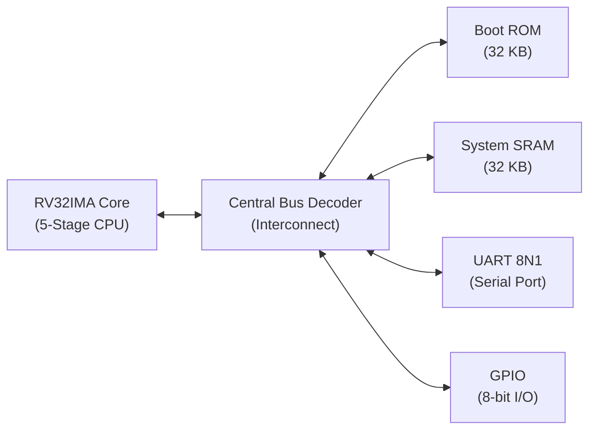
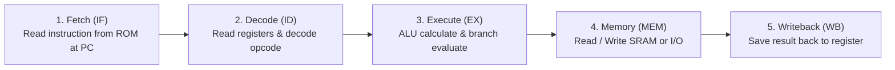

# Minimal RV32IMA Microcontroller

<div align="center">

[-blue.svg?style=for-the-badge&logo=microchip)](rtl/)
[](docs/isa.md)
[](syn/)
[](docs/saed_integration.md)
[-brightgreen.svg?style=for-the-badge)](docs/verification.md)
[-red.svg?style=for-the-badge)](syn/constraints.sdc)

**A clean, synthesizable 32-bit RISC-V Microcontroller implemented in IEEE 1800-2017 SystemVerilog.**  
Targeting **Synopsys Design Compiler** and **IC Compiler II** with the **Synopsys SAED PDK**.

[Architecture](docs/architecture.md) • [ISA Reference](docs/isa.md) • [Memory Map](docs/memory_map.md) • [Verification](docs/verification.md) • [SAED Integration](docs/saed_integration.md) • [Web Visualizer](visualizer/)

</div>

---

## Table of Contents

- [Overview](#overview)
- [System Architecture](#system-architecture)
- [5-Stage Pipeline Overview](#5-stage-pipeline-overview)
- [Key Features](#key-features)
- [Memory Map](#memory-map)
- [Repository Layout](#repository-layout)
- [Getting Started](#getting-started)
  - [Prerequisites](#prerequisites)
  - [1. Compile Firmware](#1-compile-firmware)
  - [2. Run Regression Test Suite](#2-run-regression-test-suite)
  - [3. Interactive Web Visualizer](#3-interactive-web-visualizer)
  - [4. Waveform Inspection](#4-waveform-inspection)
  - [5. ASIC Logic Synthesis](#5-asic-logic-synthesis)
- [ASIC Implementation Metrics](#asic-implementation-metrics)
- [Verification Matrix](#verification-matrix)
- [Documentation Index](#documentation-index)
- [License](#license)

---

## Overview

The **Minimal RV32IMA Microcontroller** (`rv32ima_mcu`) is a single-issue, in-order System-on-Chip (SoC) designed for embedded control and ASIC implementation.

It combines a 5-stage RISC-V CPU core supporting Base Integer (**RV32I**), Hardware Multiplication/Division (**RV32M**), and Atomic Memory Operations (**RV32A**) with on-chip memories, a central interconnect bus, an 8N1 UART serial port, and an 8-bit GPIO peripheral.

---

## System Architecture



---

## 5-Stage Pipeline Overview

The processor processes instructions across five sequential pipeline stages:



| Stage | Name | What Happens |
| :---: | :--- | :--- |
| **IF** | **Instruction Fetch** | Reads the 32-bit instruction from memory at the current Program Counter (`PC`). |
| **ID** | **Instruction Decode** | Decodes the instruction type, reads source registers (`rs1`, `rs2`), and extracts immediate values. |
| **EX** | **Execute** | The ALU computes the arithmetic result; branches/jumps are evaluated and target addresses calculated. |
| **MEM** | **Memory Access** | Performs loads or stores to data memory (SRAM / peripherals); handles atomic memory operations. |
| **WB** | **Writeback** | Writes the computed ALU result or loaded memory value back into the destination register (`rd`). |

---

## Key Features

### Processor Core (`rv32_core.sv`)
- **RV32I Base Integer**: Full 32-bit user instruction set (arithmetic, logic, shifts, loads, stores, branches, jumps).
- **RV32M Hardware Math**: Integer multiplication and division acceleration.
- **RV32A Atomic Operations**: Full support for `LR.W`, `SC.W`, and Read-Modify-Write atomics (`AMOADD`, `AMOSWAP`, `AMOXOR`, `AMOAND`, `AMOOR`, `AMOMIN`, `AMOMAX`, etc.).
- **Data Forwarding**: Resolves data dependencies (RAW hazards) transparently without pipeline stalls.
- **Hardware Hazard Unit**: Automatically resolves load-use hazards via 1-cycle bubble injection and flushes pipeline on branch redirects.
- **Machine-Mode CSRs**: Hardware trap control and timer counters (`mstatus`, `mie`, `mtvec`, `mepc`, `mcause`, `mcycle`).

### SoC Peripherals & Subsystems
- **Zero-Wait Bus**: Centralized memory-mapped interconnect with byte-enable strobes (`wstrb[3:0]`).
- **Memory Subsystem**: Switchable between generic synthesizable RAM for simulation and vendor SAED SRAM hard macro for ASIC tapeout.
- **8N1 Serial UART**: Standard serial communication interface with programmable baud rate divisor.
- **8-bit Bidirectional GPIO**: Independent output-drive and input-sampling controls with synchronized inputs.

---

## Memory Map

| Base Address | End Address | Region | Size | Access | Description |
| :--- | :--- | :--- | :---: | :---: | :--- |
| `0x0000_0000` | `0x0000_7FFF` | **Boot ROM** | 32 KB | R / X | Firmware reset vector, startup code, constants |
| `0x1000_0000` | `0x1000_7FFF` | **SRAM** | 32 KB | R / W / X | Stack, heap, and runtime variables |
| `0x2000_0000` | `0x2000_0FFF` | **UART** | 4 KB | R / W | Serial port `TXDATA`, `RXDATA`, `STATUS`, `BAUD` registers |
| `0x2000_1000` | `0x2000_1FFF` | **GPIO** | 4 KB | R / W | 8-bit general-purpose I/O `DATA` and `DIR` registers |
| `0x2000_2000` | `0x2000_2FFF` | **Timer** | 4 KB | R / W | *Reserved placeholder for system timer* |

---

## Repository Layout

```
minimal_mcu/
├── rtl/                         # Synthesizable SystemVerilog source files
│   ├── core/                    # ALU, regfile, decoder, hazard/forwarding/atomic units
│   ├── pipeline/                # IF/ID, ID/EX, EX/MEM, MEM/WB stage registers
│   ├── bus/                     # Central address decoder & interconnect bus
│   ├── memory/                  # ROM, behavioral RAM, SAED macro wrapper
│   ├── peripherals/             # 8N1 UART and 8-bit GPIO controllers
│   └── rv32ima_mcu.sv           # SoC top-level wrapper
│
├── tb/                          # Self-checking testbenches (14 testbenches)
├── sw/                          # Bare-metal C & Assembly firmware
├── visualizer/                  # Interactive browser-based simulation dashboard
├── syn/                         # Synopsys Design Compiler synthesis scripts
├── reports/                     # Implementation, area, and timing reports
├── docs/                        # Complete technical documentation & ISA manuals
├── run_tests.py                 # Automated regression test runner
└── README.md                    # Project overview
```

---

## Getting Started

### Prerequisites

| Tool | Purpose |
| :--- | :--- |
| **Icarus Verilog** (`iverilog` &ge; v11) | RTL logic simulation and test regression |
| **RISC-V GCC Toolchain** | Firmware compilation (`-march=rv32ima -mabi=ilp32`) |
| **GTKWave** (Optional) | Waveform inspection (`.vcd` files) |
| **Synopsys Design Compiler** (Optional) | ASIC logic synthesis with SAED PDK |

---

### 1. Compile Firmware

```bash
cd sw/
make
make disasm
```

This compiles `sw/main.c` into `sw/build/firmware.hex` (the memory image preloaded into the Boot ROM).

---

### 2. Run Regression Test Suite

```bash
python3 run_tests.py
```

Runs all 14 unit and integration testbenches and produces a JSON report:

```json
{
  "total_testbenches": 14,
  "testbenches_passed": 14,
  "testbenches_failed": 0,
  "total_checks_passed": 185,
  "total_checks_failed": 0
}
```

---

### 3. Interactive Web Visualizer

You can explore cycle-by-cycle execution, inspect pipeline registers, view memory, and track GPIO states in your browser:

```bash
python3 -m http.server 8080 --directory visualizer/
# Open http://localhost:8080 in your browser
```

---

### 4. Waveform Inspection

```bash
gtkwave sim/mcu_waves.vcd
```

---

### 5. ASIC Logic Synthesis

```bash
cd syn/
dc_shell -f dc.tcl | tee syn_run.log
```

---

## ASIC Implementation Metrics

Synthesis summary using **Synopsys Design Compiler** with **SAED 32nm Standard Cells** (`saed32rvt_ss0p75v125c`):

```
==================================================================
  ASIC Synthesis Summary (Synopsys Design Compiler)
==================================================================
  Top-Level Module     : rv32ima_mcu
  Process Node         : SAED 32nm RVT
  Clock Target         : 50.0 MHz (Period = 20.0 ns)
  Total Cell Count     : 817,310 cells
  Total Cell Area      : 3,079,298 um² (~3.08 mm²)
  Timing Slack         : MET (0 violations at 50 MHz)
==================================================================
```

---

## Verification Matrix

| Phase | Module Under Test | Testbench File | Checks | Status |
| :---: | :--- | :--- | :---: | :---: |
| **1** | ALU (`alu.sv`) | [`tb/tb_alu.sv`](tb/tb_alu.sv) | 24 | :white_check_mark: **PASS** |
| **1** | Register File (`regfile.sv`) | [`tb/tb_regfile.sv`](tb/tb_regfile.sv) | 4 | :white_check_mark: **PASS** |
| **1** | Immediate Gen (`immediate_gen.sv`) | [`tb/tb_immediate_gen.sv`](tb/tb_immediate_gen.sv) | 10 | :white_check_mark: **PASS** |
| **1** | Instruction Decoder (`decoder.sv`) | [`tb/tb_decoder.sv`](tb/tb_decoder.sv) | 48 | :white_check_mark: **PASS** |
| **2** | Pipeline Regs (`if_id`, `id_ex`, etc.) | [`tb/tb_pipeline_regs.sv`](tb/tb_pipeline_regs.sv) | 17 | :white_check_mark: **PASS** |
| **3** | Branch Unit (`branch_unit.sv`) | [`tb/tb_branch_unit.sv`](tb/tb_branch_unit.sv) | 17 | :white_check_mark: **PASS** |
| **4** | Forwarding Unit (`forwarding_unit.sv`) | [`tb/tb_forwarding_unit.sv`](tb/tb_forwarding_unit.sv) | 8 | :white_check_mark: **PASS** |
| **4** | Hazard Unit (`hazard_unit.sv`) | [`tb/tb_hazard_unit.sv`](tb/tb_hazard_unit.sv) | 7 | :white_check_mark: **PASS** |
| **5** | Core Integration (`rv32_core.sv`) | [`tb/tb_core.sv`](tb/tb_core.sv) | 14 | :white_check_mark: **PASS** |
| **6** | Atomic Unit (`atomic_unit.sv`) | [`tb/tb_atomic_unit.sv`](tb/tb_atomic_unit.sv) | 15 | :white_check_mark: **PASS** |
| **7** | Bus & Memory (`bus_decoder`, `memory_wrapper`) | [`tb/tb_memory.sv`](tb/tb_memory.sv) | 6 | :white_check_mark: **PASS** |
| **8** | UART Controller (`uart.sv`) | [`tb/tb_uart.sv`](tb/tb_uart.sv) | 7 | :white_check_mark: **PASS** |
| **9** | GPIO Controller (`gpio.sv`) | [`tb/tb_gpio.sv`](tb/tb_gpio.sv) | 4 | :white_check_mark: **PASS** |
| **10** | SoC Top Level (`rv32ima_mcu.sv`) | [`tb/tb_mcu.sv`](tb/tb_mcu.sv) | 4 | :white_check_mark: **PASS** |

**Total: 185 self-checking verification points — 100% Pass Rate.**

---

## Documentation Index

- 📖 **[Architecture Specification (`docs/architecture.md`)](docs/architecture.md)** — Detailed pipeline stages, forwarding logic, hazard unit, and atomic submodules.
- 📐 **[ISA Reference & Encodings (`docs/isa.md`)](docs/isa.md)** — Complete RV32I, RV32M, and RV32A instruction set manual.
- 🗺️ **[System Memory Map (`docs/memory_map.md`)](docs/memory_map.md)** — Address map, peripheral register definitions, and C driver headers.
- 🧪 **[Verification Plan & Results (`docs/verification.md`)](docs/verification.md)** — Verification methodology, coverage matrix, and test commands.
- 🔌 **[SAED SRAM Macro Integration (`docs/saed_integration.md`)](docs/saed_integration.md)** — Guide for integrating foundry SRAM macros.

---

## License

This project is licensed under the MIT License. Designed in SystemVerilog for educational, research, and ASIC prototyping applications.
