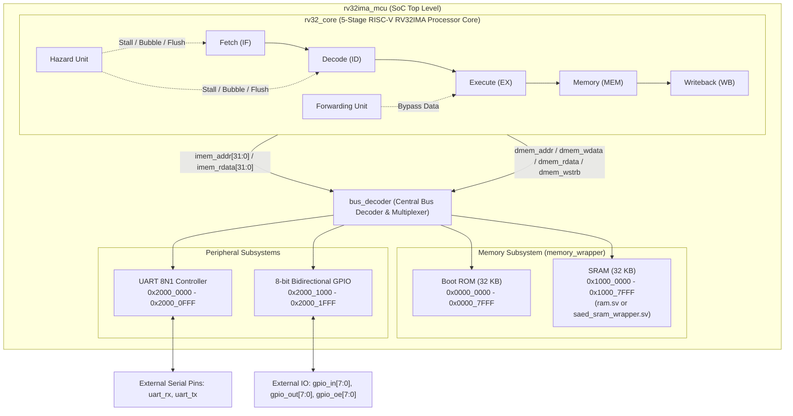
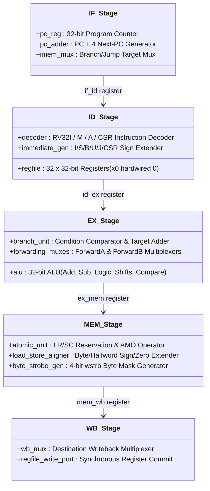
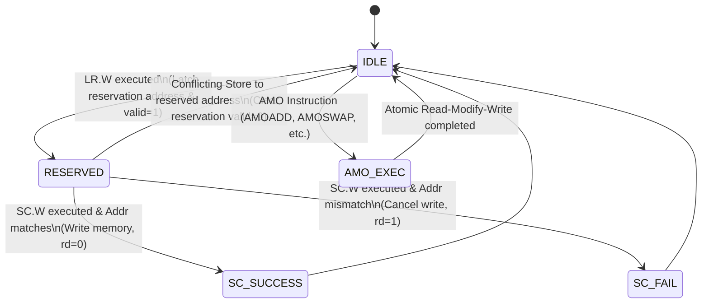

# Microcontroller Architecture Specification

<div align="center">

**[← Back to README](../README.md)** • **[ISA Reference](isa.md)** • **[Memory Map](memory_map.md)** • **[Verification](verification.md)** • **[SAED Integration](saed_integration.md)**

</div>

---

## 1. Top-Level SoC Architecture

The **Minimal RV32IMA Microcontroller** (`rv32ima_mcu`) is a 32-bit single-issue, in-order microcontroller designed for embedded control applications and ASIC implementation using Synopsys Design Compiler with the SAED PDK.



---

## 2. Processor Pipeline Microarchitecture

The core is structured around a classic 5-stage synchronous RISC pipeline with fully interlocked hardware hazard detection, transparent operand forwarding, and atomic memory execution.

```
       +--------+      +--------+      +--------+      +--------+      +--------+
       |   IF   | ===> |   ID   | ===> |   EX   | ===> |  MEM   | ===> |   WB   |
       | Fetch  |      | Decode |      |Execute |      | Memory |      |Writebk |
       +--------+      +--------+      +--------+      +--------+      +--------+
           ^               ^               |               |               |
           |               |               +-------+-------+               |
           |               |                       |                       |
           |               |                Forwarding Paths               |
           |               |                       |                       |
           |               |                       v                       |
           |         Hazard Stall / Flush <== [Hazard Unit]                |
           +---------------------------------------------------------------+
```

### Pipeline Stage Breakdown



---

### Stage 1: Instruction Fetch (IF)
- **Submodules**: [`rtl/core/pc_reg.sv`](../rtl/core/pc_reg.sv)
- **Functionality**:
  - Maintains the 32-bit Program Counter register (`pc`).
  - Calculates the default sequential instruction address (`pc + 4`).
  - Selects the next PC between sequential `pc + 4` and branch/jump targets from the Execute stage based on `pc_src`.
  - Interfaces directly with the instruction bus (`imem_addr = pc`).
  - Supports synchronous freeze/hold when stalled by the Hazard Unit (`pc_stall`).

---

### Stage 2: Instruction Decode (ID)
- **Submodules**: [`rtl/core/decoder.sv`](../rtl/core/decoder.sv), [`rtl/core/regfile.sv`](../rtl/core/regfile.sv), [`rtl/core/immediate_gen.sv`](../rtl/core/immediate_gen.sv)
- **Functionality**:
  - **Register File (`regfile.sv`)**: Contains 32 32-bit general-purpose registers (`x0` through `x31`). Features two asynchronous read ports (`rs1_data`, `rs2_data`) and one synchronous write port (`rd_data`, `rd_addr`, `reg_write_en`). Register `x0` is hardwired to `32'h0000_0000`.
  - **Immediate Generator (`immediate_gen.sv`)**: Extracts and sign-extends 32-bit immediates for I-type, S-type, B-type, U-type, J-type, and CSR immediate formats.
  - **Main Decoder (`decoder.sv`)**: Generates control signals for ALU operation, operand multiplexer sources, memory write/read strobes, branch types, CSR accesses, and atomic triggers.

---

### Stage 3: Execute (EX)
- **Submodules**: [`rtl/core/alu.sv`](../rtl/core/alu.sv), [`rtl/core/branch_unit.sv`](../rtl/core/branch_unit.sv), [`rtl/core/forwarding_unit.sv`](../rtl/core/forwarding_unit.sv)
- **Functionality**:
  - **Arithmetic Logic Unit (`alu.sv`)**: Performs 32-bit arithmetic (ADD, SUB), logical (AND, OR, XOR), barrel shifts (SLL, SRL, SRA), and comparisons (SLT, SLTU).
  - **Branch Unit (`branch_unit.sv`)**: Evaluates branch conditions (BEQ, BNE, BLT, BGE, BLTU, BGEU) and computes jump targets for JAL and JALR (with LSB zero-masking).
  - **Operand Multiplexers**: Select between register data, PC values, immediate constants, and bypassed forwarding data from later pipeline stages.

---

### Stage 4: Memory Access (MEM)
- **Submodules**: [`rtl/core/atomic_unit.sv`](../rtl/core/atomic_unit.sv), [`rtl/bus/bus_decoder.sv`](../rtl/bus/bus_decoder.sv)
- **Functionality**:
  - Issues memory read/write requests onto the system data bus (`dmem_valid`, `dmem_addr`, `dmem_wdata`, `dmem_wstrb`).
  - **Byte Strobe Generation**: Converts access width (Byte, Halfword, Word) and address lower bits into the 4-bit write strobe (`wstrb[3:0]`).
  - **Load Data Alignment**: Slices and sign-extends or zero-extends read data from memory (`LB`, `LH`, `LW`, `LBU`, `LHU`).
  - **Atomic Operations (`atomic_unit.sv`)**: Manages the LR/SC reservation register and handles single-cycle Read-Modify-Write atomic ALU computations.

---

### Stage 5: Register Writeback (WB)
- **Functionality**:
  - Multiplexes the final result destined for the register file from four primary sources:
    1. ALU calculation result (`WB_SRC_ALU`)
    2. Data loaded from memory (`WB_SRC_MEM`)
    3. Link return address `PC + 4` (`WB_SRC_PC4`)
    4. Atomic unit return value (`WB_SRC_AMO`)
  - Commits the selected data into register `rd` on the rising clock edge if `reg_write` is enabled and `rd != 0`.

---

## 3. Hazard Detection & Forwarding Architecture

### Data Hazard Resolution (Bypass & Forwarding)
The **Forwarding Unit** (`forwarding_unit.sv`) detects Read-After-Write (RAW) data dependencies between instructions in the EX stage and earlier instructions currently in the EX/MEM or MEM/WB pipeline registers.

| Dependency Case | Forward Condition | Action |
| :--- | :--- | :--- |
| **EX &larr; EX/MEM (Hazard 1)** | `ex_mem_reg_write && (ex_mem_rd != 0) && (ex_mem_rd == id_ex_rs1)` | Forward `ex_mem_alu_result` directly into ALU Operand A |
| **EX &larr; EX/MEM (Hazard 2)** | `ex_mem_reg_write && (ex_mem_rd != 0) && (ex_mem_rd == id_ex_rs2)` | Forward `ex_mem_alu_result` directly into ALU Operand B |
| **EX &larr; MEM/WB (Hazard 3)** | `mem_wb_reg_write && (mem_wb_rd != 0) && (mem_wb_rd == id_ex_rs1)` | Forward `mem_wb_write_data` into ALU Operand A |
| **EX &larr; MEM/WB (Hazard 4)** | `mem_wb_reg_write && (mem_wb_rd != 0) && (mem_wb_rd == id_ex_rs2)` | Forward `mem_wb_write_data` into ALU Operand B |

> [!NOTE]
> EX/MEM forwarding has higher priority than MEM/WB forwarding to guarantee that the most recent architectural state is bypassed.

---

### Load-Use Hazards (1-Cycle Bubble Stall)
When an instruction in the Decode (ID) stage depends on a value produced by a preceding `LOAD` instruction currently in the Execute (EX) stage, the data is not yet available in time for immediate ALU execution.

```
Cycle 1:  LW   x1, 0(x2)   -->  [EX] (Address calculated, data not yet loaded)
Cycle 2:  ADD  x3, x1, x4  -->  [ID] (Needs x1, but x1 is still in MEM stage)
```

**Resolution**:
1. The **Hazard Unit** detects: `id_ex_mem_read && ((id_ex_rd == if_id_rs1) || (id_ex_rd == if_id_rs2))`
2. Injects a 1-cycle **bubble** (NOP) into the `id_ex` stage register (`id_ex_flush = 1`).
3. Holds the `pc_reg` and `if_id` pipeline registers (`pc_stall = 1`, `if_id_stall = 1`).
4. On the subsequent cycle, the loaded data arrives at MEM/WB and is forwarded into the EX stage via normal bypass paths without data loss.

---

### Control Hazards (Branches and Jumps)
Branches and jumps are evaluated in the **Execute (EX)** stage:
- **Taken Branch / Jump Penalty**: 2 clock cycles.
- When a branch condition evaluates to `TRUE` or an unconditional jump (`JAL`/`JALR`) executes:
  1. `pc_src` asserts, redirecting `pc_reg` to the branch/jump target.
  2. The Hazard Unit asserts `if_id_flush` and `id_ex_flush`, purging the two speculative instructions fetched behind the branch.

---

## 4. Atomic Subsystem (RV32A Extension)

The **Atomic Unit** ([`rtl/core/atomic_unit.sv`](../rtl/core/atomic_unit.sv)) provides full hardware support for the RISC-V `A` extension:



### Supported Atomic Operations:
1. **Load-Reserved / Store-Conditional (`LR.W` / `SC.W`)**:
   - `LR.W rd, (rs1)`: Loads 32-bit word into `rd` and registers `rs1` in the internal reservation address register.
   - `SC.W rd, rs2, (rs1)`: Checks if reservation address matches and remains valid. If valid, writes `rs2` to memory and returns `rd = 0` (success). If invalid, prevents the write and returns `rd = 1` (failure).
2. **Read-Modify-Write Atomics (AMO)**:
   - `AMOSWAP.W`, `AMOADD.W`, `AMOXOR.W`, `AMOAND.W`, `AMOOR.W`, `AMOMIN.W`, `AMOMAX.W`, `AMOMINU.W`, `AMOMAXU.W`.
   - Returns the original memory contents in register `rd` and commits the arithmetic/logical result to memory atomically.

---

## 5. Bus Interconnect & Memory Architecture

The SoC implements a memory-mapped, zero wait-state synchronous bus decoded by [`rtl/bus/bus_decoder.sv`](../rtl/bus/bus_decoder.sv).

```
                      +-----------------------------+
                      |         rv32_core           |
                      +-----------------------------+
                           |                   |
                     Instruction Bus        Data Bus
                           |                   |
                           v                   v
                      +-----------------------------+
                      |         bus_decoder         |
                      +-----------------------------+
                        |         |         |     |
              +---------+         |         |     +--------+
              |                   |         |              |
              v                   v         v              v
        +-----------+       +-----------+ +----+       +------+
        | Boot ROM  |       |   SRAM    | |UART|       | GPIO |
        | (32 KB)   |       |  (32 KB)  | |8N1 |       |8-bit |
        +-----------+       +-----------+ +----+       +------+
```

### Memory Wrapper Isolation (`memory_wrapper.sv`)
The memory subsystem provides vendor neutrality:
- **RTL Simulation (`ram.sv`)**: Standard SystemVerilog synthesizable array for zero-dependency testbench execution.
- **ASIC Implementation (`saed_sram_wrapper.sv`)**: Enabled via `+define+USE_SAED_MEMORY`. Instantiates the SAED 32nm SRAM hard macro, wiring chip-enable (`CEN`), write-enable (`WEN`), and active-low bit write enables (`BWEN[31:0]`).

---

## 6. Integrated Peripheral Subsystems

### 8N1 UART Serial Controller (`uart.sv`)
- **Memory Base**: `0x2000_0000`
- **Features**:
  - Programmable baud rate generator: $\text{Divisor} = \frac{f_{\text{CLK}}}{\text{Baud Rate}}$
  - Standard 8-bit data, No parity, 1 Stop bit (8N1).
  - Double-register synchronizer on `uart_rx` input to prevent metastability.
  - Status register with `TX_READY` and `RX_VALID` flags.

### 8-bit Bidirectional GPIO Controller (`gpio.sv`)
- **Memory Base**: `0x2000_1000`
- **Features**:
  - 8 independently configurable I/O lines.
  - Output enable direction mask (`gpio_oe`) configured via `DIR` register.
  - Double-flop synchronized input latching on `gpio_in`.
  - Readback of live pin states or driven output registers.
