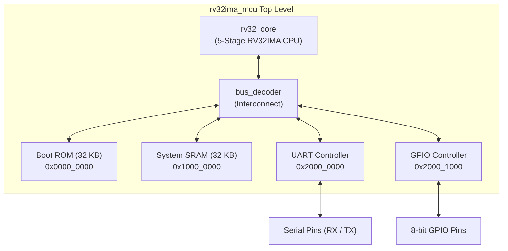
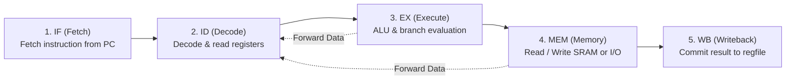
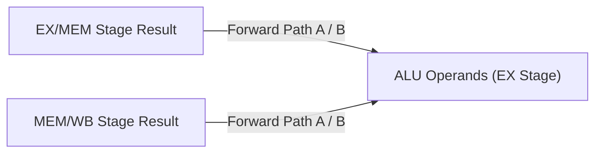
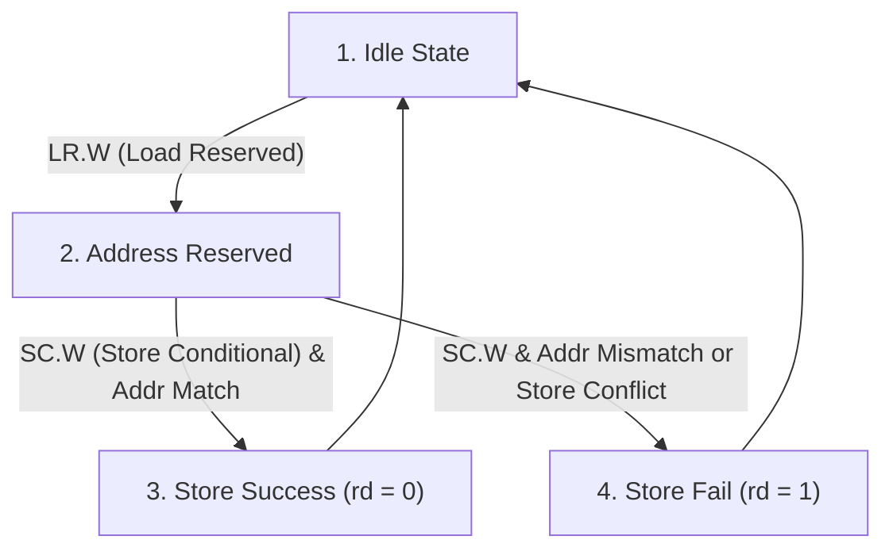
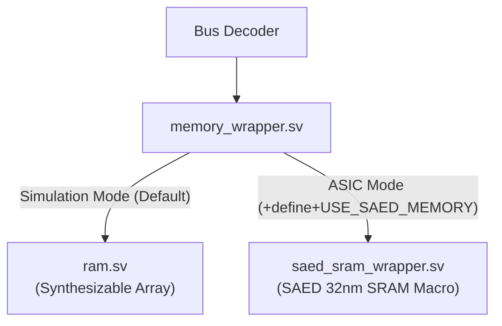

# Microcontroller Architecture Specification

<div align="center">

**[← Back to README](../README.md)** • **[ISA Reference](isa.md)** • **[Memory Map](memory_map.md)** • **[Verification](verification.md)** • **[SAED Integration](saed_integration.md)**

</div>

---

## 1. Top-Level SoC Architecture

The **Minimal RV32IMA Microcontroller** (`rv32ima_mcu`) is a 32-bit single-issue, in-order microcontroller. It connects the 5-stage CPU core to memories and peripherals through a centralized memory-mapped bus decoder.



---

## 2. 5-Stage Pipeline Architecture

The processor implements a classic RISC 5-stage synchronous pipeline:



---

### Pipeline Stage Details

```
       +--------+      +--------+      +--------+      +--------+      +--------+
       |   IF   | ===> |   ID   | ===> |   EX   | ===> |  MEM   | ===> |   WB   |
       | Fetch  |      | Decode |      |Execute |      | Memory |      |Writebk |
       +--------+      +--------+      +--------+      +--------+      +--------+
```

| Stage | Primary Module | Key Functionality |
| :---: | :--- | :--- |
| **IF** | [`pc_reg.sv`](../rtl/core/pc_reg.sv) | Maintains `PC`, selects next address (`PC+4` or branch/jump target), fetches 32-bit instruction. |
| **ID** | [`decoder.sv`](../rtl/core/decoder.sv), [`regfile.sv`](../rtl/core/regfile.sv), [`immediate_gen.sv`](../rtl/core/immediate_gen.sv) | Reads source registers `rs1` and `rs2`, decodes control signals, sign-extends immediate values. |
| **EX** | [`alu.sv`](../rtl/core/alu.sv), [`branch_unit.sv`](../rtl/core/branch_unit.sv), [`forwarding_unit.sv`](../rtl/core/forwarding_unit.sv) | Executes arithmetic/logic calculations, checks branch conditions, computes jump targets. |
| **MEM**| [`atomic_unit.sv`](../rtl/core/atomic_unit.sv), [`bus_decoder.sv`](../rtl/bus/bus_decoder.sv) | Formats byte/halfword/word access, applies `wstrb[3:0]` strobes, tracks LR/SC reservations. |
| **WB** | [`rv32_core.sv`](../rtl/core/rv32_core.sv) | Selects final result (ALU, Memory, PC+4, or CSR) and commits into register `rd`. |

---

## 3. Hazard Detection & Forwarding

### Data Forwarding (Zero-Stall Bypass)
The Forwarding Unit automatically routes recent computation results directly to the Execute stage operands without stalling the pipeline:



| Forwarding Condition | Source | Target |
| :--- | :--- | :--- |
| `ex_mem_reg_write && (ex_mem_rd == id_ex_rs1)` | EX/MEM ALU Result | ALU Operand A |
| `ex_mem_reg_write && (ex_mem_rd == id_ex_rs2)` | EX/MEM ALU Result | ALU Operand B |
| `mem_wb_reg_write && (mem_wb_rd == id_ex_rs1)` | MEM/WB Write Data | ALU Operand A |
| `mem_wb_reg_write && (mem_wb_rd == id_ex_rs2)` | MEM/WB Write Data | ALU Operand B |

---

### Load-Use Hazard (1-Cycle Bubble Stall)
When an instruction immediately uses the result of a preceding `LOAD` instruction:
1. The **Hazard Unit** detects `id_ex_mem_read && ((id_ex_rd == if_id_rs1) || (id_ex_rd == if_id_rs2))`.
2. A 1-cycle bubble (NOP) is injected into `ID/EX`.
3. `PC` and `IF/ID` registers hold their values for one cycle.
4. Data is forwarded on the subsequent cycle with zero data corruption.

---

### Control Hazards (Branches and Jumps)
- Branch condition checks and jump targets are resolved in the **EX stage**.
- When a branch is taken or a jump (`JAL`/`JALR`) executes:
  - `PC` updates to the target address.
  - The Hazard Unit flushes `IF/ID` and `ID/EX` stages (2-cycle branch penalty).

---

## 4. Atomic Subsystem (RV32A Extension)

The **Atomic Unit** ([`rtl/core/atomic_unit.sv`](../rtl/core/atomic_unit.sv)) provides hardware support for synchronization primitives:



- **`LR.W`**: Loads word from memory and latches the reservation address.
- **`SC.W`**: Writes memory only if the reservation remains valid; returns `0` on success or `1` on failure.
- **Atomic Read-Modify-Write (AMO)**: Atomically reads memory, performs ALU operation (`ADD`, `SWAP`, `XOR`, `AND`, `OR`, `MIN`, `MAX`), and writes back the updated value.

---

## 5. Memory Subsystem & Abstraction

The memory wrapper provides clean separation between RTL simulation and ASIC tapeout:



---

## 6. Integrated Peripherals

### 8N1 UART Serial Controller (`uart.sv`)
- **Base Address**: `0x2000_0000`
- **Features**:
  - Programmable baud rate divisor: `Divisor = CLK_HZ / BAUD_RATE`
  - 8 data bits, no parity, 1 stop bit (8N1).
  - Double-flop synchronized RX input to eliminate metastability.
  - Status register with `TX_READY` (bit 0) and `RX_VALID` (bit 1).

### 8-bit Bidirectional GPIO (`gpio.sv`)
- **Base Address**: `0x2000_1000`
- **Features**:
  - 8 configurable I/O pins.
  - Direction register (`DIR`): `1` = Output mode, `0` = Input mode.
  - Synchronized input sampling with readable pin state register (`DATA`).
