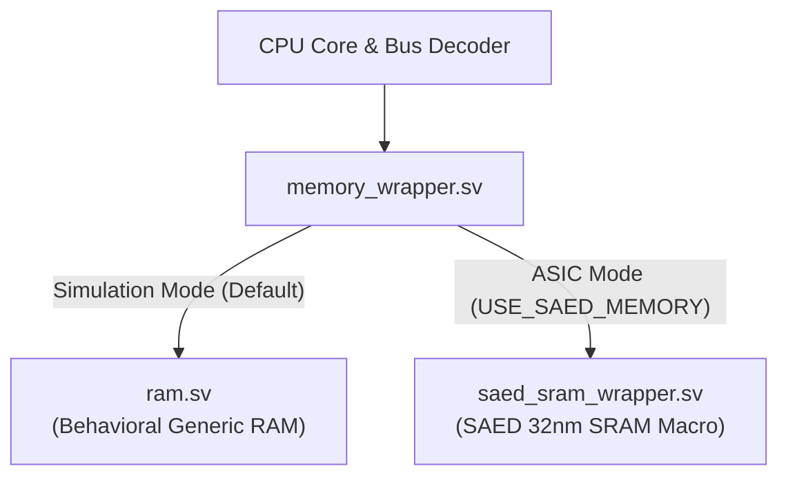
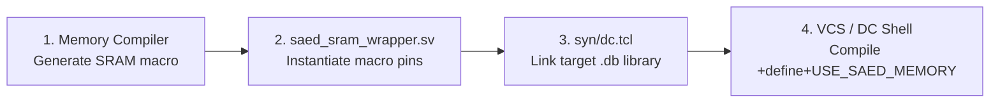

# SAED SRAM Macro Integration Guide

<div align="center">

**[← Back to README](../README.md)** • **[Architecture](architecture.md)** • **[ISA Reference](isa.md)** • **[Memory Map](memory_map.md)** • **[Verification](verification.md)**

</div>

---

## 1. Overview & Vendor Neutrality

The memory subsystem of the **Minimal RV32IMA MCU** provides complete isolation between the CPU core and foundry-specific SRAM hard macros:



> [!NOTE]
> The CPU core and bus decoder are **fully insulated** from PDK-specific details. Only [`rtl/memory/saed_sram_wrapper.sv`](../rtl/memory/saed_sram_wrapper.sv) references foundry macro pin names.

---

## 2. SRAM Macro Specifications

To match the address space and bus timing of the MCU, configure the SAED Memory Compiler with the following parameters:

| Parameter | Value | Description |
| :--- | :--- | :--- |
| **Organization** | 8192 words &times; 32 bits | 13-bit word address (`A[12:0]`) |
| **Memory Capacity** | 32 Kilobytes (32 KB) | Full SRAM region (`0x1000_0000 – 0x1000_7FFF`) |
| **Port Type** | Single-Port (SP) Synchronous | Shared read/write port |
| **Write Masking** | Active-low bit write enables | `BWEN[31:0]` (8 bits per byte lane) |
| **Operating Voltage** | 0.75 V – 1.05 V | Scalable for SAED32 RVT / HVT cells |
| **Read Latency** | 1 clock cycle | Read data valid in MEM stage cycle |

### Macro Delivery Collateral
The memory compiler generates:
- `*.lib` / `*.db`: Synopsys Liberty timing and power models for Design Compiler synthesis.
- `*.lef`: Layout abstract file containing pin geometry and blockages for IC Compiler II PnR.
- `*.v` / `*.sv`: Behavioral Verilog simulation model.
- `*.gds`: Full physical mask layout for chip fabrication tapeout.

---

## 3. Step-by-Step Integration Flow



---

### Step 1: Update Wrapper Pin Mappings
Open [`rtl/memory/saed_sram_wrapper.sv`](../rtl/memory/saed_sram_wrapper.sv) and instantiate the generated hard macro:

```systemverilog
// Control signals are already pre-decoded in saed_sram_wrapper.sv:
//   cen_n     = ~en                                  (Active-low chip enable)
//   wen_n     = ~we                                  (Active-low write enable)
//   bwen_n    = {{8{~wstrb[3]}}, {8{~wstrb[2]}},     (Active-low per-bit write mask)
//                {8{~wstrb[1]}}, {8{~wstrb[0]}}}
//   word_addr = addr[14:2]                           (Word-indexed 13-bit address)

SAED32_SRAM_SP_8192X32 u_saed_sram (
  .CLK    (clk),
  .CEN    (cen_n),
  .WEN    (wen_n),
  .BWEN   (bwen_n),
  .A      (word_addr),
  .D      (wdata),
  .Q      (rdata)
);
```

---

### Step 2: Configure Synthesis Libraries (`syn/dc.tcl`)
In [`syn/dc.tcl`](../syn/dc.tcl), ensure the SRAM `.db` is added to `target_library` and `link_library`:

```tcl
# Specify path to SAED Standard Cells and SRAM Macro DBs
set SAED_STDCELL_DB  "/path/to/saed_pdk/lib/saed32rvt_ss0p75v125c.db"
set SAED_SRAM_DB     "/path/to/saed_memory/lib/saed32_sram_8192x32_ss0p75v125c.db"

set_app_var target_library [list $SAED_STDCELL_DB $SAED_SRAM_DB]
set_app_var link_library   [list $SAED_STDCELL_DB $SAED_SRAM_DB "*"]

# Analyze RTL with macro switch enabled
analyze -format sverilog -define {USE_SAED_MEMORY} [glob rtl/**/*.sv]
```

---

### Step 3: Run Gate-Level Simulation
Verify macro timing and functional read/write strobes using Synopsys VCS or Icarus Verilog:

```bash
# Compile and simulate memory subsystem unit test
vcs -sverilog +define+USE_SAED_MEMORY -f sim/filelist.f -top tb_memory -R

# Run full MCU regression with macro enabled
vcs -sverilog +define+USE_SAED_MEMORY -f sim/filelist.f -top tb_mcu -R
```

---

## 4. Pin Mapping & Polarity Reference

| Generic Bus Signal | Direction | SAED SRAM Macro Pin | Active Polarity | Description |
| :--- | :---: | :--- | :---: | :--- |
| `clk` | Input | `CLK` | Rising Edge | System clock |
| `en` | Input | `CEN` | Active-Low (`~en`) | Chip enable / access strobe |
| `we` | Input | `WEN` | Active-Low (`~we`) | Write enable |
| `wstrb[3:0]` | Input | `BWEN[31:0]` | Active-Low bit-mask | Byte write enable expansion |
| `addr[14:2]` | Input | `A[12:0]` | High | Word-aligned 13-bit address |
| `wdata[31:0]` | Input | `D[31:0]` | High | 32-bit write data |
| `rdata[31:0]` | Output | `Q[31:0]` | High | 32-bit synchronous read data |

---

## 5. Physical Design & Floorplanning Notes

When placing the SRAM hard macro in **Synopsys IC Compiler II**:
1. **Macro Orientation**: Place the macro along chip edges to minimize routing congestion over the core logic area.
2. **Halo & Keepout Margins**: Maintain a minimum keep-out spacing of 5 um to prevent standard cell placement violations adjacent to macro pins.
3. **Power Strapping**: Ensure robust VDD and VSS ring connections around the macro boundary to prevent dynamic IR drop during synchronous multi-bit write operations.
