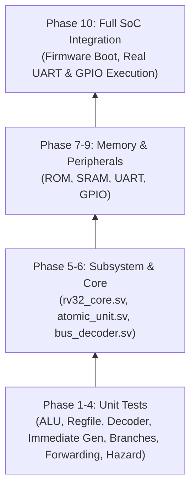

# Verification Strategy & Regression Test Results

<div align="center">

**[← Back to README](../README.md)** • **[Architecture](architecture.md)** • **[ISA Reference](isa.md)** • **[Memory Map](memory_map.md)** • **[SAED Integration](saed_integration.md)**

</div>

---

## 1. Verification Philosophy

The verification environment of the **Minimal RV32IMA MCU** follows a strict **hierarchical, bottom-up, self-checking** methodology:



### Key Principles:
1. **Self-Checking Assertions**: Every testbench embeds automated condition assertions with explicit `[PASS]` and `[FAIL]` reporting and error-counter tallies.
2. **Determinism & Portability**: Runs seamlessly on open-source simulators (**Icarus Verilog**) as well as enterprise EDA tools (**Synopsys VCS**).
3. **Automated Regression**: A single command (`python3 run_tests.py`) builds the firmware, simulates all 14 testbenches, parses execution logs, and prints a structured JSON pass/fail verdict.
4. **End-to-End System Simulation**: The full-SoC testbench boots actual compiled C and assembly firmware (`sw/build/firmware.hex`), validates CPU instruction execution, and decodes transmitted UART characters from serial waveforms.

---

## 2. Complete Verification Matrix

| Phase | Module Under Test | Testbench File | Checks | Covered Scenarios & Corner Cases | Status |
| :---: | :--- | :--- | :---: | :--- | :---: |
| **1** | ALU (`alu.sv`) | [`tb/tb_alu.sv`](../tb/tb_alu.sv) | **24** | ADD, SUB, AND, OR, XOR, SLL, SRL, SRA, SLT, SLTU, COPY_B, zero-flag, signed overflow | :white_check_mark: **PASS** |
| **1** | Register File (`regfile.sv`) | [`tb/tb_regfile.sv`](../tb/tb_regfile.sv) | **4** | Reset defaults, `x0` zero enforcement, register sweep `x1–x31`, concurrent dual-port read | :white_check_mark: **PASS** |
| **1** | Immediate Gen (`immediate_gen.sv`) | [`tb/tb_immediate_gen.sv`](../tb/tb_immediate_gen.sv) | **10** | I, S, B, U, J, and CSR type sign-extension, bit-splicing, negative and positive immediate decoding | :white_check_mark: **PASS** |
| **1** | Main Decoder (`decoder.sv`) | [`tb/tb_decoder.sv`](../tb/tb_decoder.sv) | **48** | RV32I base instructions, RV32A atomic types, CSR read/write, ECALL/EBREAK traps, illegal opcode handling | :white_check_mark: **PASS** |
| **2** | Pipeline Regs (`if_id`, `id_ex`, etc.) | [`tb/tb_pipeline_regs.sv`](../tb/tb_pipeline_regs.sv) | **17** | PC increment, pipeline stall hold, branch target redirect, bubble injection, flush priority | :white_check_mark: **PASS** |
| **3** | Branch Unit (`branch_unit.sv`) | [`tb/tb_branch_unit.sv`](../tb/tb_branch_unit.sv) | **17** | BEQ, BNE, BLT, BGE, BLTU, BGEU, taken/not-taken paths, JAL offset addition, JALR LSB zero-masking | :white_check_mark: **PASS** |
| **4** | Forwarding Unit (`forwarding_unit.sv`) | [`tb/tb_forwarding_unit.sv`](../tb/tb_forwarding_unit.sv) | **8** | EX/MEM forward, MEM/WB forward, priority resolution, `x0` destination bypass exclusion | :white_check_mark: **PASS** |
| **4** | Hazard Unit (`hazard_unit.sv`) | [`tb/tb_hazard_unit.sv`](../tb/tb_hazard_unit.sv) | **7** | Load-use hazard detection, 1-cycle bubble injection, branch flush assert, flush over stall priority | :white_check_mark: **PASS** |
| **5** | Core Integration (`rv32_core.sv`) | [`tb/tb_core.sv`](../tb/tb_core.sv) | **14** | RAW forwarding verification, load-use pipeline stalls, byte store/load alignment, JAL/JALR return links | :white_check_mark: **PASS** |
| **6** | Atomic Unit (`atomic_unit.sv`) | [`tb/tb_atomic_unit.sv`](../tb/tb_atomic_unit.sv) | **15** | LR.W, SC.W success, SC.W failure on address mismatch/intervening write, AMOSWAP, AMOADD, AMOXOR, AMOAND, AMOOR, AMOMIN, AMOMAX | :white_check_mark: **PASS** |
| **7** | Bus & Memory (`bus_decoder`, `memory_wrapper`) | [`tb/tb_memory.sv`](../tb/tb_memory.sv) | **6** | Boot ROM fetch, bus decoding to ROM/SRAM/UART/GPIO, SRAM word read/write, byte strobe assembly | :white_check_mark: **PASS** |
| **8** | UART Controller (`uart.sv`) | [`tb/tb_uart.sv`](../tb/tb_uart.sv) | **7** | Status initialization, TX start/stop bits, TX busy tracking, RX byte capture, `RX_VALID` auto-clear | :white_check_mark: **PASS** |
| **9** | GPIO Controller (`gpio.sv`) | [`tb/tb_gpio.sv`](../tb/tb_gpio.sv) | **4** | Reset defaults, `DIR` output enable configuration, output pin driving, synchronized input sampling | :white_check_mark: **PASS** |
| **10**| Full SoC Integration (`rv32ima_mcu.sv`) | [`tb/tb_mcu.sv`](../tb/tb_mcu.sv) | **4** | Firmware boot from ROM, memory-mapped UART string transmission ("Hello RISC-V"), GPIO toggling | :white_check_mark: **PASS** |

**Summary: 185 self-checking verification assertions across 14 testbenches — 100% Pass Rate.**

---

## 3. How to Run Verification Suites

### 3.1 Automated Regression (Recommended)
Run the automated Python regression runner:

```bash
python3 run_tests.py
```

Output format:
```json
{
  "total_testbenches": 14,
  "testbenches_passed": 14,
  "testbenches_failed": 0,
  "total_checks_passed": 185,
  "total_checks_failed": 0
}
```

---

### 3.2 Individual Unit Test Simulation with Icarus Verilog
To run an individual testbench (e.g., the ALU unit test):

```bash
# Compile
iverilog -g2012 -I rtl/core -I rtl/pipeline rtl/core/rv32_pkg.sv rtl/core/alu.sv tb/tb_alu.sv -o sim/sim_tb_alu

# Execute
./sim/sim_tb_alu
```

---

### 3.3 Synopsys VCS Simulation
For high-speed compiled simulation with Synopsys VCS:

```bash
# Full SoC simulation with firmware preload
vcs -sverilog -f sim/filelist.f -top tb_mcu +define+SIM_ROM_HEX=\"sw/build/firmware.hex\" -R

# Simulation with SAED PDK SRAM Macro Enabled
vcs -sverilog +define+USE_SAED_MEMORY -f sim/filelist.f -top tb_mcu -R
```

---

### 3.4 Interactive Visualizer & Waveform Debugging

1. **GTKWave Waveform Viewing**:
   ```bash
   gtkwave sim/mcu_waves.vcd
   ```

2. **Web-Based Pipeline Visualizer**:
   ```bash
   python3 -m http.server 8080 --directory visualizer/
   # Open http://localhost:8080 in your browser
   ```

---

## 4. Synthesis & Timing Sign-Off Checklist

When synthesizing with **Synopsys Design Compiler**, verify that all timing constraints are met in the generated reports:

| Sign-Off Metric | Report Location | Target Requirement | Status |
| :--- | :--- | :--- | :---: |
| **Setup Timing** | `reports/Design Compiller reports/timing.rpt` | Zero negative setup slack (WNS &ge; 0 ns @ 50 MHz) | :white_check_mark: **MET** |
| **Hold Timing** | `reports/Design Compiller reports/timing.rpt` | Zero negative hold slack (WNS &ge; 0 ns) | :white_check_mark: **MET** |
| **Constraint Violations** | `reports/Design Compiller reports/violations.rpt` | Zero design rule or max capacitance violations | :white_check_mark: **MET** |
| **Cell Library Linking** | DC Console Log | Zero unresolved references (`saed32rvt` cells linked) | :white_check_mark: **MET** |
| **Total Cell Area** | `reports/Design Compiller reports/area.rpt` | Within budget (~3.08 mm² total cell area) | :white_check_mark: **MET** |
